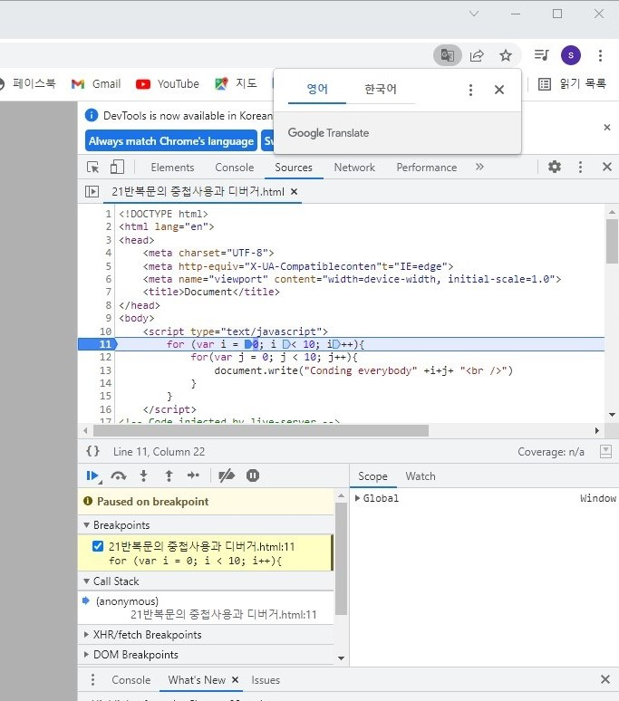



# JavaScript 반복문

 
 

---

## 1. 반복문 기본문법-while
 
 
반복문(Loop iterate)은 사람이 하기힘든 반복 작업을 하기위해 사용하고, 몇가지 문법이 있다.
 
 

### while
 
 
while의 형식은 아래와같다. 조건이 true인 동안에 { } 안의 데이터를 반복하게 된다.

~~~javascript

while (조건){
    반복해서 실행할 코드
}

~~~

---

## 2. 반복조건
 
 
반복조건이 없다면 반복문이 무한대로 실행이되게된다. 반복조건을 설정해 적당한 시기에 반복이 정지하도록 해줘야한다.

 
 
아래 예제는 i의 시작값을 0으로 정했고 한번씩 반복 할때마다 'coding everybody  '문장이 실행되고 i가 1씩 늘어나게 된다. i의 값이 9가되면 반복을 멈추게 된다.

~~~javascript

var i = 0;
while(i < 10){
    document.write('coding everybody  ');
    i++
}
~~~

---

## 3. for문
 
 
for문의 형식은 아래와 같다. while 과 for문은 둘다 반복문이고 대체가능하다.

~~~javascript

for(초기화; 반복조건; 반복이 될 때마다 실행되는 코드){
    반복해서 실행될 코드
}

for(var i = 0; i < 10; i++){   // i = i + 1 과 i ++는 같다.
    document.write('coding everybody'+i+' ');
}
~~~

i++는 해당 구문을 실행할때마다 i값을 1씩 증가시킨다는 말이다. i=0이라고 시작하면 0
부터 시작하게 된다. 
++i는 해당 구문을 실행할때부터 1을 증가시킨채 실행한다. i=0이라고하면 시작부터 1로 시작한다.

---

## 4. 반복문의 효용성
 
 
반복문이 없다면 코드를 복사해서 붙여넣기 하면 된다. 하지만 반복 횟수가 많아지면 많아질수록 힘들어질 것이다. 
 
 
아래 예제의 두 코드는 같은 내용이다. 어떤 작업이 더 편할까?

~~~javascript

document.write('coding everybody');
document.write('coding everybody');
document.write('coding everybody');
document.write('coding everybody');
document.write('coding everybody');
document.write('coding everybody');
document.write('coding everybody');
document.write('coding everybody');
document.write('coding everybody');
document.write('coding everybody');
document.write('coding everybody');

var i = 0;
while(i < 10){
    document.write('coding everybody  ');
    i++;
}

~~~

그런데 'coding everybody'뒤에 순서를 써야하고 그 양이 많다면 불가능해 질것이다. 반복문으로 코드를 작성하면 간단하다.

~~~javascript

var i = 0;
while(i < 10) {
    document.write('coding everybody' + i +  );
}

~~~

---

### 5. 반복문의 제어
 
 
반복문을 강제 정지시키거나 정지후 재시작 하기위한 명령어를 알아보자.
 
 

### break
 
 
break는 반복문을 중간에 중단시키게 해준다. 아래 예제는 0~4까지 출력하고 중단하게 된다.

~~~javascript
for(var i = 0; i < 10; i++){
    if(i === 5) {
        break;
    }
    document.write('coding everybody'+i+' ');
}
~~~

### continue
 
 
continue는 지정된 부분에선 반복을 중단하고 반복을 재시작할 수 있게 해준다. 아래의 코드를 실행해보자.

~~~javascript

for(var i = 0; i < 10; i++){
    if(i === 5) {
        continue;
    }
    document.write('coding everybody'+i+' ');
}

~~~

i===5에서 continue를 하겠다고 했기때문에 i의 값이 5가되었을 때는 실행을 중단하고 다음 i값부터 다시 반복하게 된다.

~~~javascript

coding everybody 0
coding everybody 1
coding everybody 2
coding everybody 3
coding everybody 4
coding everybody 6
coding everybody 7
coding everybody 8
coding everybody 9

~~~

### 6. 반복문의 중첩사용과 디버거
 
 
반복문안에 반복문을 중첩해 사용할수 있다. 아래 예제에선 i와j를 0~9까지 반복하고 그i와j는 숫자이고 숫자끼리 더해지게 되는데 아래 처럼 문자열과 숫자의 결합하는 경우 javascript는 숫자인 부분을 문자로 변환해 준다.

~~~javascript

for(var i = 0; i < 10; i++){
    for(var j = 0; j < 10; j++ ) {
    document.write('coding everybody' + i + j + ' ');
    }
}

~~~

위코드를 실행해 보면 00~99까지의 i와j가 출력된다.
 
 

### 디버거
 
 
우리가 만든 코드의 버그를 확인하고 코드 실행 순서를 볼 수 있는 기능을 알아보자. F12키를 눌러 개발자도구를 열고 console로 들어가 보고자 하는 줄의 코드를 선택하고 F5를 눌러 새로고침한다.
그리고 버튼을 활용해 실행 순서를 확인해 보자.

